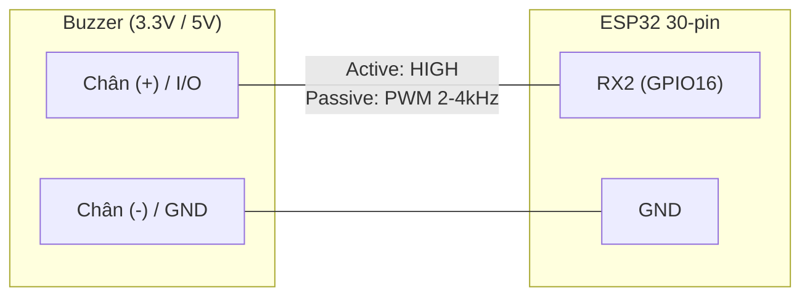

```mermaid
flowchart LR
    subgraph BUZ["Buzzer (3.3V / 5V)"]
        B_P["Chân (+) / I/O"]
        B_N["Chân (-) / GND"]
    end

    subgraph ESP["ESP32 30-pin"]
        E_16["RX2 (GPIO16)"]
        E_GND["GND"]
    end

    B_P ---|"Active: HIGH<br/>Passive: PWM 2-4kHz"| E_16
    B_N --- E_GND
```