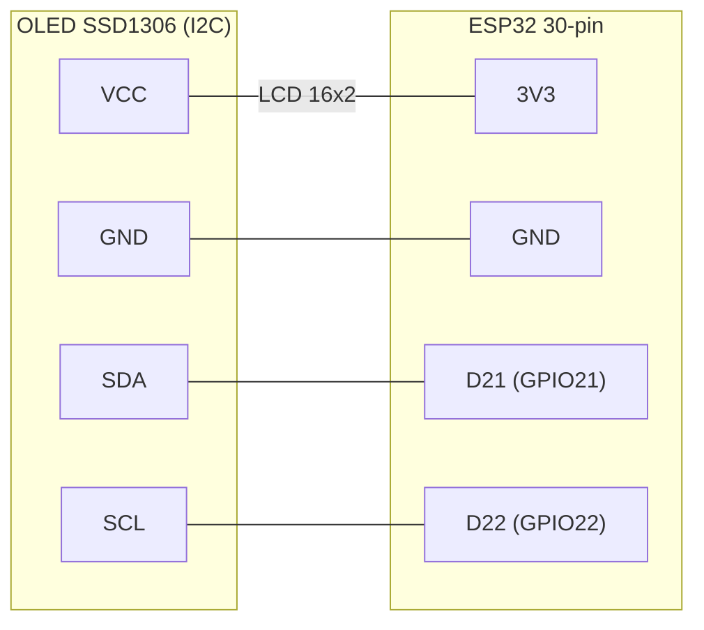

```mermaid
flowchart LR
    subgraph DISP["OLED SSD1306 (I2C)"]
        D_VCC["VCC"]
        D_GND["GND"]
        D_SDA["SDA"]
        D_SCL["SCL"]
    end

    subgraph ESP["ESP32 30-pin"]
        E_3V3["3V3"]
        E_GND["GND"]
        E_21["D21 (GPIO21)"]
        E_22["D22 (GPIO22)"]
    end

    D_VCC ---|"LCD 16x2"| E_3V3
    D_GND --- E_GND
    D_SDA --- E_21
    D_SCL --- E_22
```