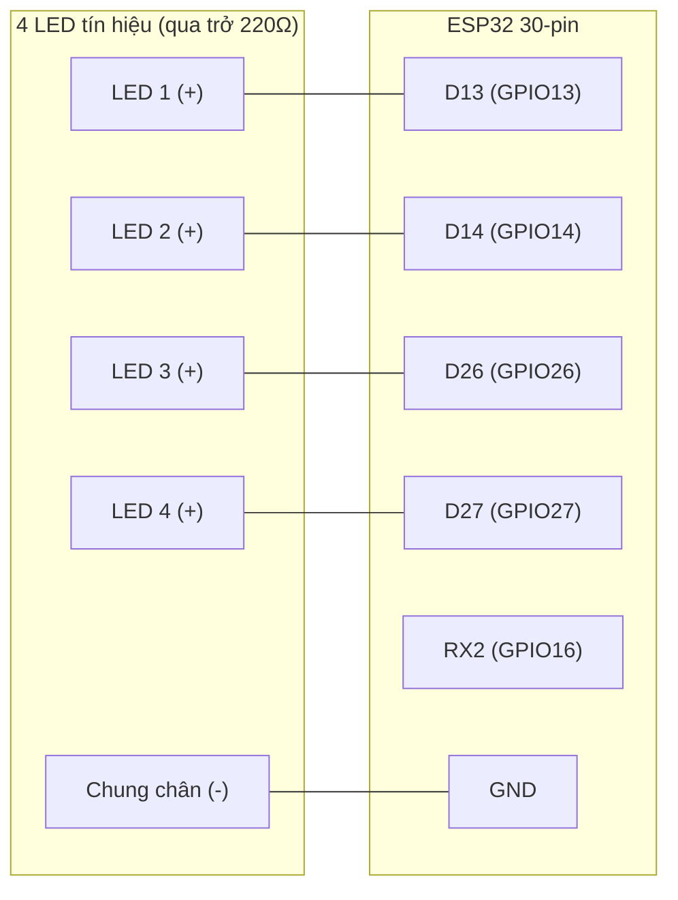

```mermaid
flowchart LR
    subgraph LEDS["4 LED tín hiệu (qua trở 220Ω)"]
        L1["LED 1 (+)"]
        L2["LED 2 (+)"]
        L3["LED 3 (+)"]
        L4["LED 4 (+)"]
        LG["Chung chân (-)"]
    end


    subgraph ESP["ESP32 30-pin"]
        E_13["D13 (GPIO13)"]
        E_14["D14 (GPIO14)"]
        E_26["D26 (GPIO26)"]
        E_27["D27 (GPIO27)"]
        E_16["RX2 (GPIO16)"]
        E_GND["GND"]
    end

    L1 --- E_13
    L2 --- E_14
    L3 --- E_26
    L4 --- E_27
    LG --- E_GND
```