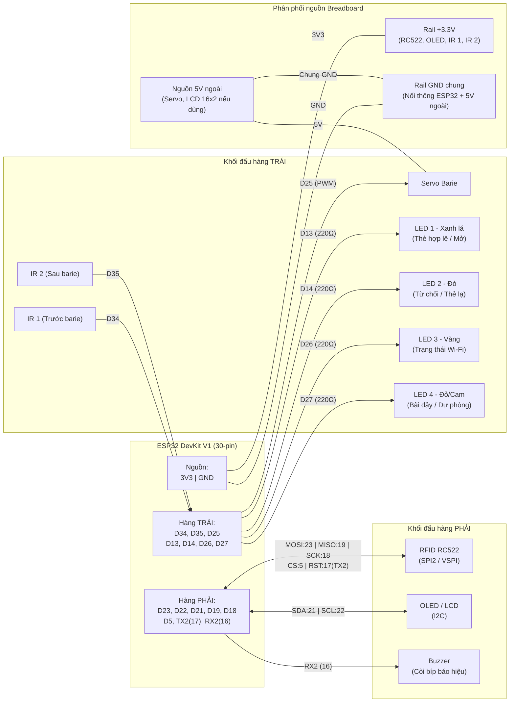

```mermaid
flowchart LR
    subgraph LEFT["Khối đấu hàng TRÁI"]
        IR1["IR 1 (Trước barie)"]
        IR2["IR 2 (Sau barie)"]
        SERVO["Servo Barie"]
        LED1["LED 1 - Xanh lá<br/>(Thẻ hợp lệ / Mở)"]
        LED2["LED 2 - Đỏ<br/>(Từ chối / Thẻ lạ)"]
        LED3["LED 3 - Vàng<br/>(Trạng thái Wi-Fi)"]
        LED4["LED 4 - Đỏ/Cam<br/>(Bãi đầy / Dự phòng)"]
    end

    subgraph ESP32["ESP32 DevKit V1 (30-pin)"]
        direction TB
        P_LEFT["Hàng TRÁI:<br/>D34, D35, D25<br/>D13, D14, D26, D27"]
        P_RIGHT["Hàng PHẢI:<br/>D23, D22, D21, D19, D18<br/>D5, TX2(17), RX2(16)"]
        P_PWR["Nguồn:<br/>3V3 | GND"]
    end

    subgraph RIGHT["Khối đấu hàng PHẢI"]
        RC522["RFID RC522<br/>(SPI2 / VSPI)"]
        OLED["OLED / LCD<br/>(I2C)"]
        BUZ["Buzzer<br/>(Còi bíp báo hiệu)"]
    end

    subgraph POWER["Phân phối nguồn Breadboard"]
        RAIL33["Rail +3.3V<br/>(RC522, OLED, IR 1, IR 2)"]
        RAIL5V["Nguồn 5V ngoài<br/>(Servo, LCD 16x2 nếu dùng)"]
        RAILGND["Rail GND chung<br/>(Nối thông ESP32 + 5V ngoài)"]
    end

    IR1 -->|"D34"| P_LEFT
    IR2 -->|"D35"| P_LEFT
    P_LEFT -->|"D25 (PWM)"| SERVO
    P_LEFT -->|"D13 (220Ω)"| LED1
    P_LEFT -->|"D14 (220Ω)"| LED2
    P_LEFT -->|"D26 (220Ω)"| LED3
    P_LEFT -->|"D27 (220Ω)"| LED4

    P_RIGHT <-->|"MOSI:23 | MISO:19 | SCK:18<br/>CS:5 | RST:17(TX2)"| RC522
    P_RIGHT <-->|"SDA:21 | SCL:22"| OLED
    P_RIGHT -->|"RX2 (16)"| BUZ

    P_PWR ---|"3V3"| RAIL33
    P_PWR ---|"GND"| RAILGND
    RAIL5V ---|"5V"| SERVO
    RAIL5V ---|"Chung GND"| RAILGND
```