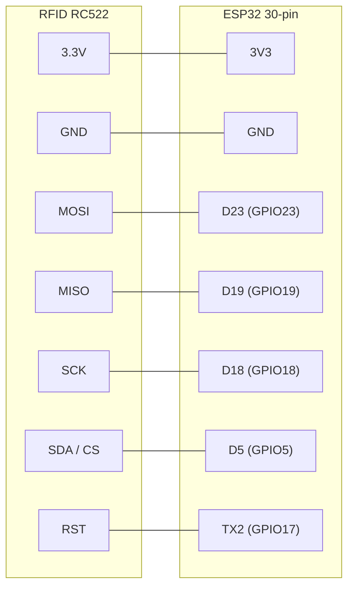

```mermaid
flowchart LR
    subgraph RC522["RFID RC522"]
        R_VCC["3.3V"]
        R_GND["GND"]
        R_MOSI["MOSI"]
        R_MISO["MISO"]
        R_SCK["SCK"]
        R_CS["SDA / CS"]
        R_RST["RST"]
    end

    subgraph ESP["ESP32 30-pin"]
        E_3V3["3V3"]
        E_GND["GND"]
        E_23["D23 (GPIO23)"]
        E_19["D19 (GPIO19)"]
        E_18["D18 (GPIO18)"]
        E_5["D5 (GPIO5)"]
        E_17["TX2 (GPIO17)"]
    end

    R_VCC --- E_3V3
    R_GND --- E_GND
    R_MOSI --- E_23
    R_MISO --- E_19
    R_SCK --- E_18
    R_CS --- E_5
    R_RST --- E_17
```