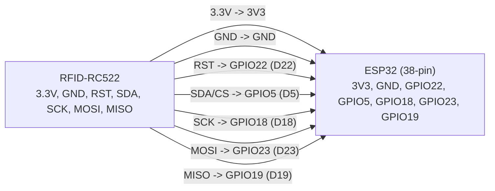

```mermaid
flowchart LR
    RC522["RFID-RC522\n3.3V, GND, RST, SDA, SCK, MOSI, MISO"]
    ESP32["ESP32 (38-pin)\n3V3, GND, GPIO22, GPIO5, GPIO18, GPIO23, GPIO19"]

    RC522 -->|"3.3V -> 3V3"| ESP32
    RC522 -->|"GND -> GND"| ESP32
    RC522 -->|"RST -> GPIO22 (D22)"| ESP32
    RC522 -->|"SDA/CS -> GPIO5 (D5)"| ESP32
    RC522 -->|"SCK -> GPIO18 (D18)"| ESP32
    RC522 -->|"MOSI -> GPIO23 (D23)"| ESP32
    RC522 -->|"MISO -> GPIO19 (D19)"| ESP32
```
