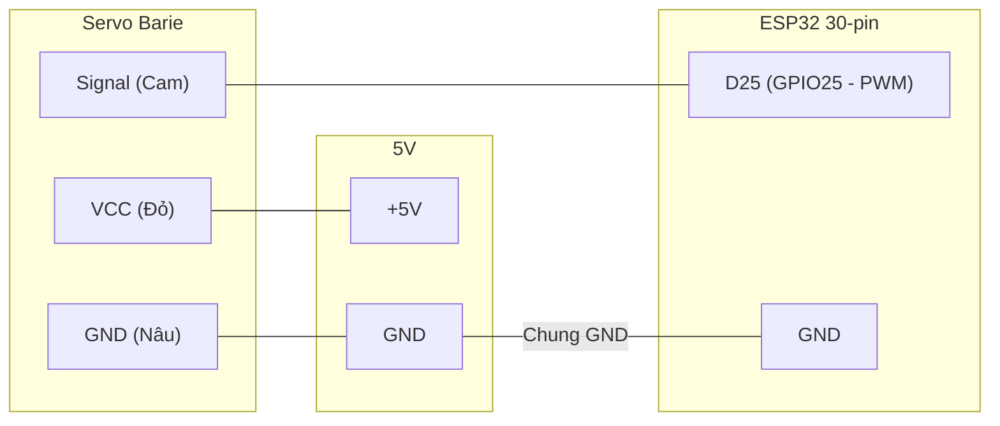

```mermaid
flowchart LR
    subgraph SERVO["Servo Barie"]
        S_SIG["Signal (Cam)"]
        S_VCC["VCC (Đỏ)"]
        S_GND["GND (Nâu)"]
    end

    subgraph ESP["ESP32 30-pin"]
        E_25["D25 (GPIO25 - PWM)"]
        E_GND["GND"]
    end

    subgraph PWR["5V"]
        P_5V["+5V"]
        P_GND["GND"]
    end

    S_SIG --- E_25
    S_VCC --- P_5V
    S_GND --- P_GND
    P_GND ---|"Chung GND"| E_GND
```